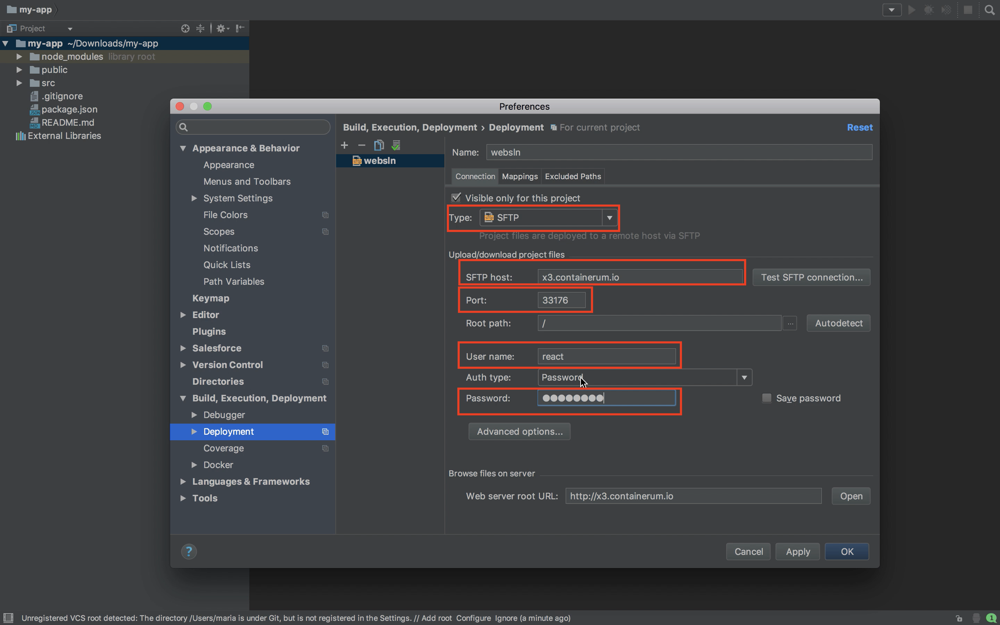
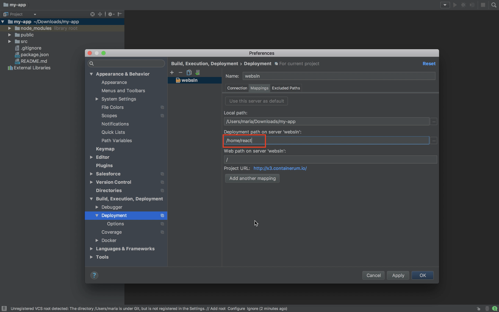
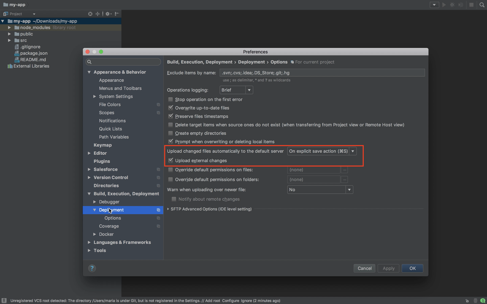
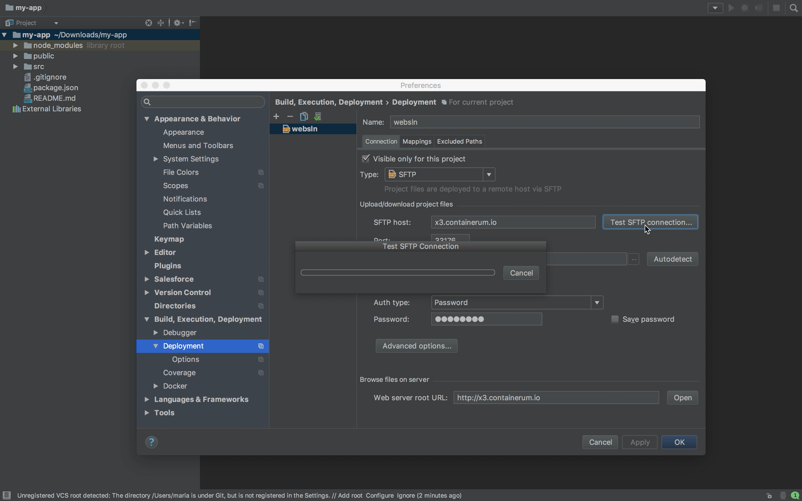
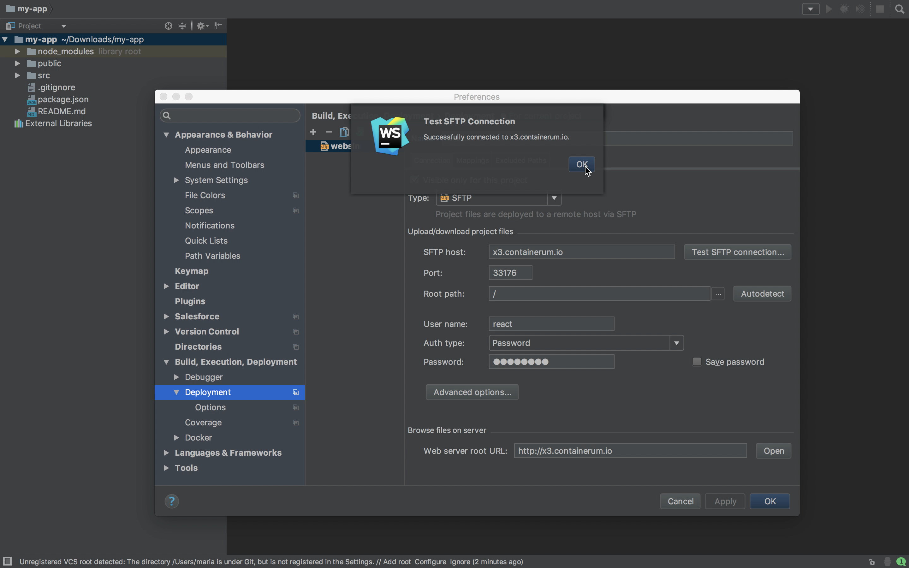
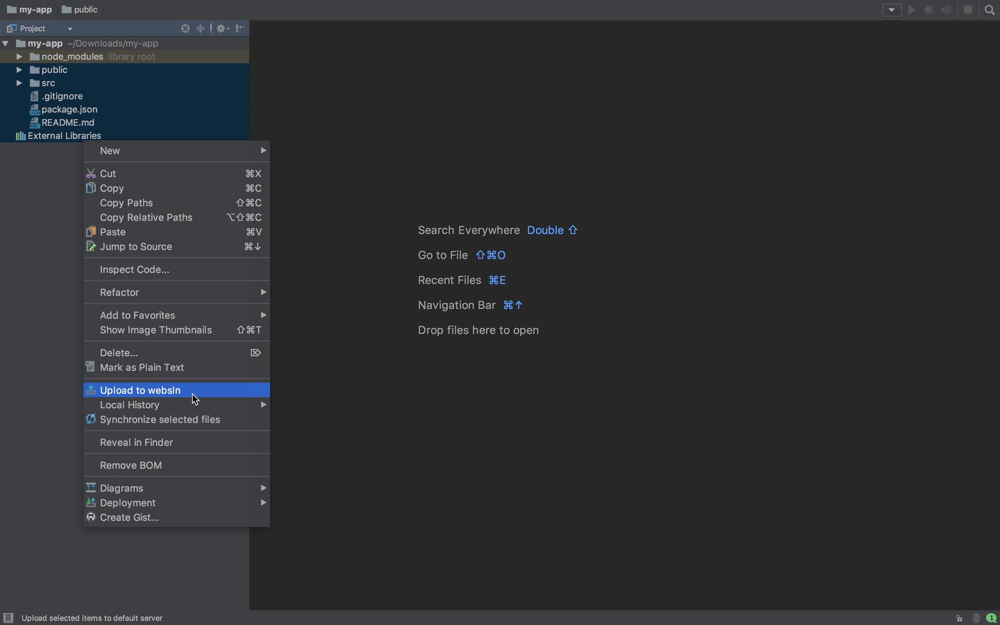
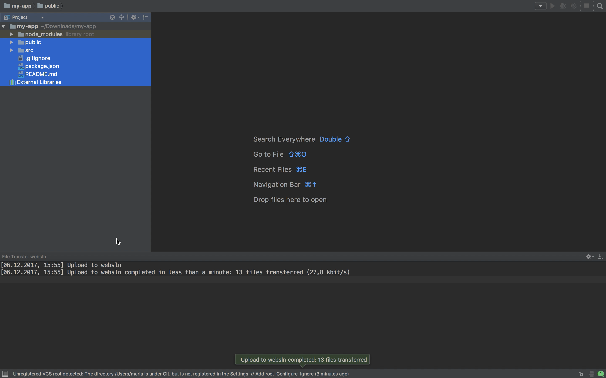

# SSH server with WebPack

This is a solution for front-end developers working with JavaScript. This is basically a self-hosted developer machine synchronized with your local developer environment (e.g. WebStorm or other IDE). Now you don't have to waste your local machine compute power to run WebPack applications.

## How it works:

SSH server captures all changes in your local project files and instantly synchronizes them with the project files on you hosting. Webpack configures your project build and displays it in your browser in real time.

Or you can use sshfs to mount a remote file system over SSH.

### It consists of:

* Ubuntu:16.04
* Openssh-server
* Nodejs
* Webpack-dev-server
* Webpack@3.8.1
* Yarn@1.3.2


To launch this solution on [Containerum.com](https://containerum.com/) sign up with the service, download and use [Containerum CLI](https://github.com/containerum/chkit) `chkit`.

1. Run the Solution with `chkit solution`:

```
$ chkit solution run containerum/webpack-3.8-ssh-solution -e USER=react -e USER_PASS=12345678 -e NAME=websln -e CPU=500m -e RAM=500Mi
```
* USER - username,
* USER_PASS - password,
* NAME - Solution name
* CPU, RAM - compute resources for this Solution

2. Make sure that the Solution is running:

```
$ chkit get deploy

+-------------------+------+-------------+------+-------+-----+
| NAME              | PODS | PODS ACTIVE | CPU  | RAM   | AGE |
+-------------------+------+-------------+------+-------+-----+
| websln-13k4y      | 1    | 1           | 500m | 500Mi | 22m |
+-------------------+------+-------------+------+-------+-----+
```
3. Check through the list of services using `chkit get` command, mark the port used to connect to the running VM:
```
$ chkit get svc

+--------------+-----------------+----------+-------------------+-------------+-----+
| NAME         | CLUSTER-IP      | EXTERNAL | HOST              | PORT(S)     | AGE |
+--------------+-----------------+----------+-------------------+-------------+-----+
| websln-13k4y | 10.105.25.198   | true     | x3.containerum.io | 33176:22/TCP| 18m |
+--------------+-----------------+----------+-------------------+-------------+-----+
```
4. Connect to the running machine:
```
$ ssh react@x3.containerum.io -p33176
```

5. Create a working directory:
```
react@websln:~$ mkdir react
```
and jump to this directory:
```
react@websln:~$ cd react
```
6. Install a sample react application on your local machine (https://github.com/facebookincubator/create-react-app):
```
$ npm install -g create-react-app
```

_Note: You'll need to have Node >= 6 on your machine._

and create a new app:
```
$ create-react-app my-app

$ cd my-app
```
Open WebStorm on your machine and set the following project settings:





Test the connection:




Upload the selected project folders to the running VM:



7. Run the following commands on the running machine:
```
react@websln:~$ npm i

react@websln:~$ npm start
```
8. To provide access to the launched Solution, we’ll create a service with `chkit expose` command locally:
```
chkit expose deploy websln-13k4y -p portname:3000:TCP
```

9. Using `chkit get` get the address and the port to access the running Solution:
```
$ chkit get svc

+-------------------+-----------------+----------+-------------------+---------------+-----+
| NAME              | CLUSTER-IP      | EXTERNAL | HOST              | PORT(S)       | AGE |
+-------------------+-----------------+----------+-------------------+---------------+-----+
| websln-13k4y      | 10.105.25.198   | true     | x3.containerum.io | 33176:22/TCP  | 22m |
+-------------------+-----------------+----------+-------------------+---------------+-----+
| websln-13k4y-3ac7 | 10.111.121.79   | true     | x2.containerum.io | 19451:3000/TCP| 9s  |
+-------------------+-----------------+----------+-------------------+---------------+-----+
```
   `http://x2.containerum.io:19451`


10. All changes that you make in `src/App.js` are now immediately reflected and can be viewed in your browser at `http://x2.containerum.io:19451`  


